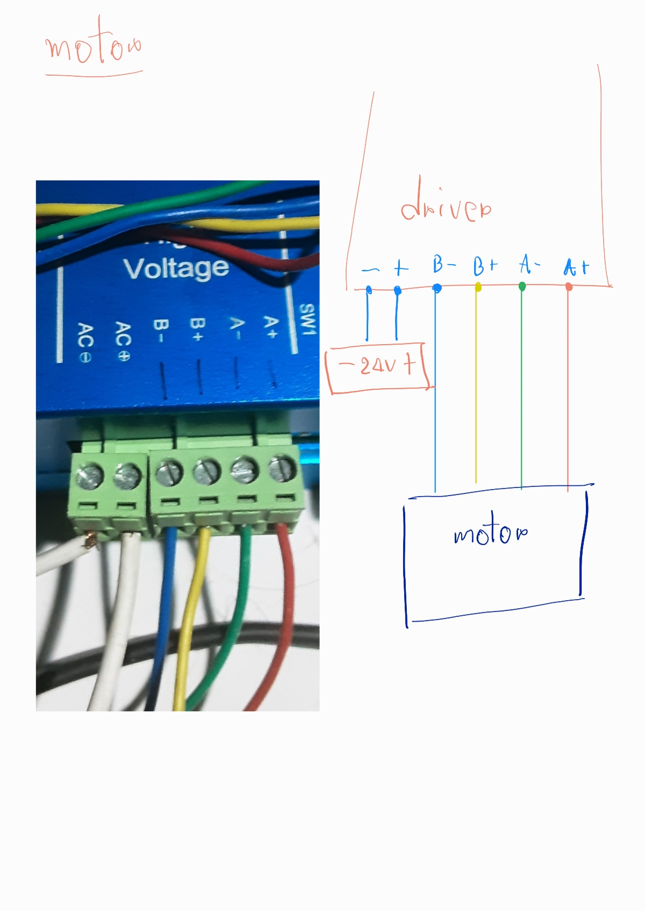
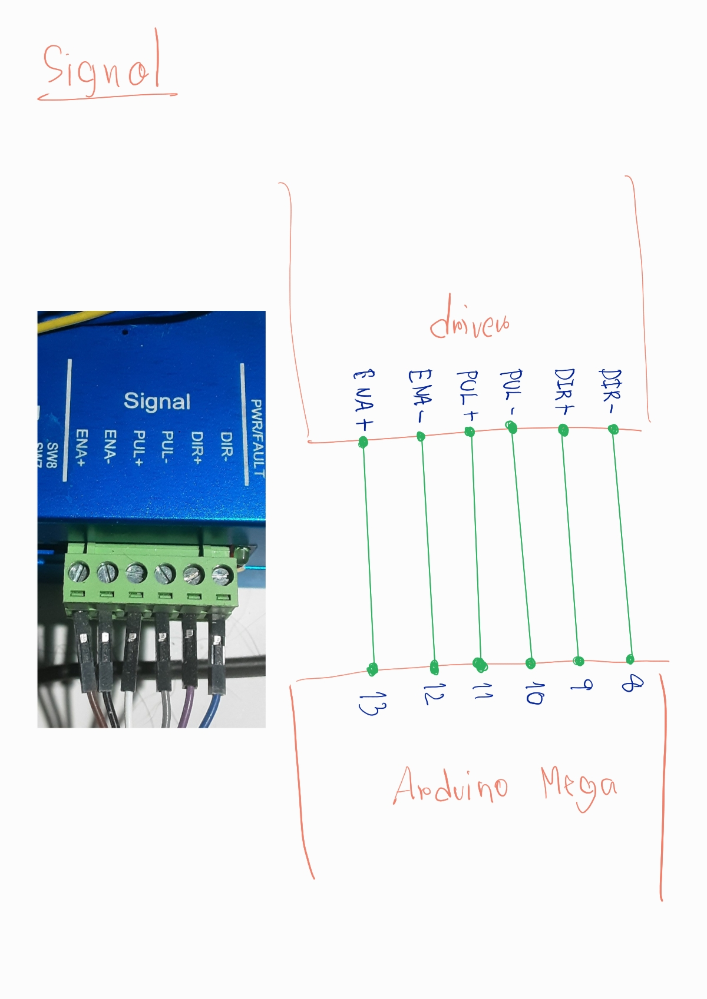
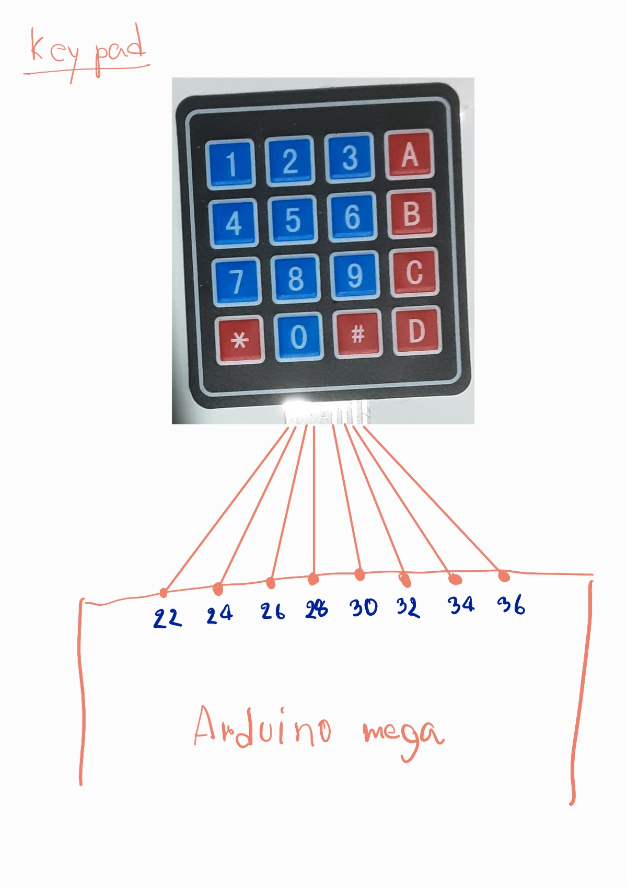
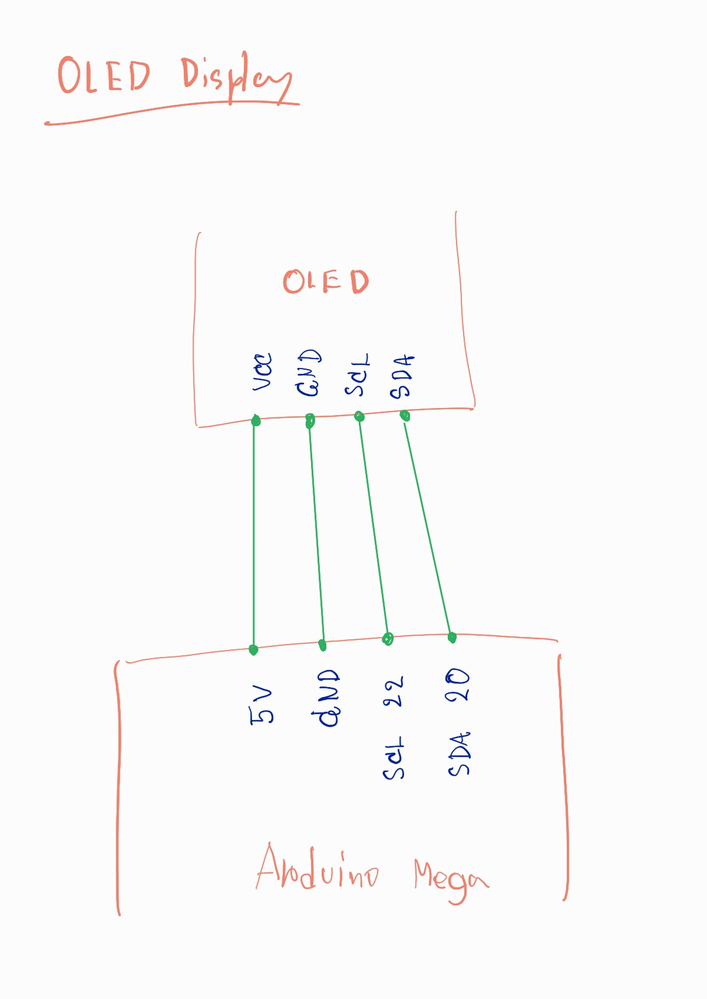
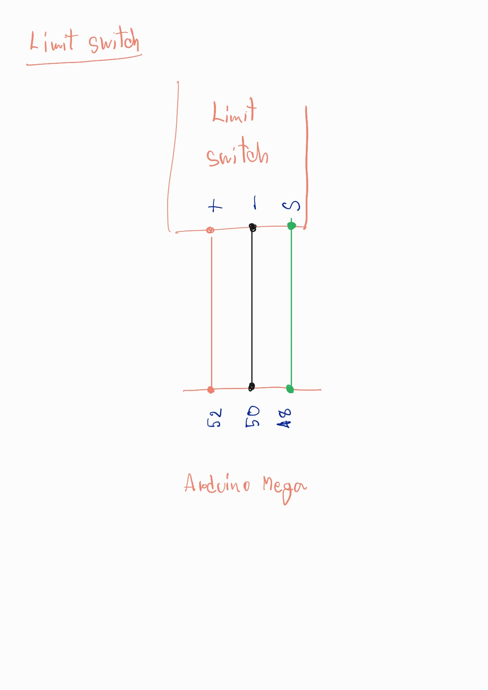

# Steper motor control
## ต่อมอเตอร์

## ต่อสัญญาณ

## ต่อปุ่มกด

## ต่อจอ

## ต่อลิมิตสวิทซ์

## วิธีใช้ปุ่มกด
### ตั้งค่าเริ่มทำงาน
 - Round   ตั้งค่า**จำนวนรอบ**
 - Speed   **ความเร็ว** มีตั้งแต่ระดับ 1 - 9 โดย9เป็นค่าเริ่มต้น และเร็วสุด
 - Span   ตั้งค่า**ระยะการทำงาน** หน่วยเป็น cm
 - \*   สำหรับ **enter** ค่า เพื่อไปขั้นตอนถัดไป
 - D   สำหรับ**ลบค่า** ขณะที่ตั้งค่า Round Speed Span เพื่อตั้งค่าใหม่

### ขณะทำงาน
- \#   เพื่อ**หยุด**การทำงาน(stop)
- \*   เพื่อ**ทำงานต่อ**จากเดิม(resume)

### ปุ่มเพิ่มเติม
- A รีสตาร์ทบอร์ด ใช้ในต้องการตั้งค่าใหม่(ตั้ง Round Speed Span) ใช้ตอนเครื่องไม่ได้ทำงานเท่านั้น
- B เลื่อน**มอเตอร์ออก** ใช้ตอนเครื่องไม่ได้ทำงานเท่านั้น
- C เลื่อน**มอเตอร์เข้า** ใช้ตอนเครื่องไม่ได้ทำงานเท่านั้น
- ปล ควบคุมการเลื่อน B C เมื่อเปลี่ยนทิศทาง มอเตอร์จะ**เลื่อนไปทางเดิมเล็กน้อย**ก่อนจะเลื่อนไปทางที่ต้องการ

### ปัญหาที่อาจเจอ
เนื่องจากสเตปเปอร์มอเตอร์ทำงานด้วยความถี่เพื่อควบคุมสเตป ทำให้มีสัญญาณความถี่ออกมา และkeypad ตัวนี้ใช้การแสกนแถวและหลัก ซึ่งทำให้เกิดคลื่นความถี่ขึ้นเช่นกัน ให้หลีกเลี่ยง keypad และสายกับ motor driver ให้อยู่ห่างกัน เพราะจะเกิดการรบกวนให้ปุ่มกดทำงานเองได้

### Motor driver
ปัจจุบันตั้งค่าไว้ที่ 400pulse/rev ซึ่งเป็นความละเอียดต่ำสุด จะได้ความเร็วมากที่สุด
